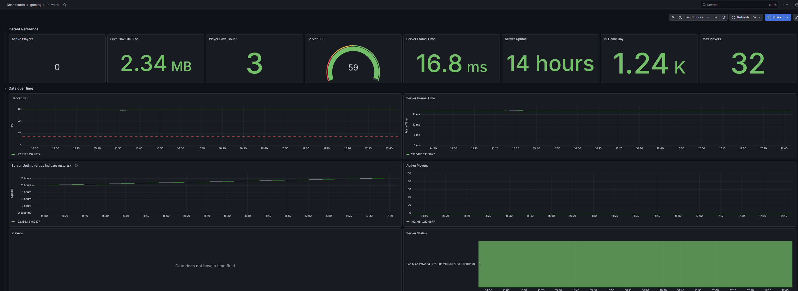

# Prometheus Exporter for Palworld Server

*Developed by https://palworld.lol/*, refactored and maintained by @smbonn2005

[](https://github.com/smbonn2005/palworld-exporter/pkgs/container/palworld-exporter)


Here is a screenshot of what's possible to graph using metrics from this exporter. This Grafana dashboard can be [downloaded here](https://grafana.com/grafana/dashboards/25672-palworld/).



---
This project contains a [Prometheus Exporter](https://prometheus.io/docs/instrumenting/exporters/) for [Palworld](https://store.steampowered.com/app/1623730/Palworld/) servers to monitor the following metrics:

| name | description | labels | metric type |
|------|-------------|--------|-------------|
| `palworld_player_count` | The current number of players on given server | no extra labels | Gauge |
| `palworld_player` | A player currently logged into the server | Character name, User ID, and Player UID | Gauge |
| `palworld_player_max` | Maximum player capacity configured on the server | no extra labels | Gauge |
| `palworld_server_info` | Server Information | Server name, Version | Gauge |
| `palworld_server_fps` | Current server FPS | no extra labels | Gauge |
| `palworld_server_frametime_milliseconds` | Current server frame time in milliseconds | no extra labels | Gauge |
| `palworld_uptime_seconds` | Server uptime in seconds since last restart | no extra labels | Gauge |
| `palworld_world_days` | Elapsed in-game days | no extra labels | Gauge |
| `palworld_up` | Indicator if last metric scrape was successful | no extra labels | Gauge |
| `palworld_player_save_count` | Number of player save files on disk. Only included if `--save-directory` specified. | no extra labels | Gauge |
| `palworld_player_save_size_bytes` | File size of a player save file in bytes | filename and player UID | Gauge
| `palworld_player_save_mtime` | Last modified time of a player save file | filename and player UID | Gauge
| `palworld_level_save_size_bytes` | File size of Level.sav in bytes | no extra labels | Gauge

*For more information of [Gauges see here](https://prometheus.io/docs/concepts/metric_types/#gauge).*

All of the metrics above, other than the `palworld_player_save_*`/`palworld_level_save_*` file metrics, are gathered via the Palworld [REST API](https://docs.palworldgame.com/api/rest-api/palwold-rest-api/), which must be enabled on your server (`RESTAPIEnabled=True` in `PalWorldSettings.ini`). This exporter no longer supports RCON — Palworld has deprecated RCON in favor of the REST API and plans to remove it in a future update.

# Options

Environment Variables are available:

- `REST_HOST`
- `REST_PORT`
- `REST_PASSWORD`
- `REST_USE_TLS`
- `LISTEN_ADDRESS`
- `LISTEN_PORT`
- `SAVE_DIRECTORY`
- `LOG_LEVEL`

# Run as Container

## Just Docker

Below is the command to run straight with docker (podman works too!). 

*NOTE*: You will need to make sure the exporter can reach the Palworld server you wish to monitor.

```
docker run -e REST_HOST=palworld -e REST_PASSWORD=topsecrt -e SAVE_DIRECTORY=/palworld -v ./palworld:/palworld:z,ro -p 9877:9877 --rm -it ghcr.io/smbonn2005/palworld-exporter
```

## Docker Compose

Here is an EXAMPLE docker compose file that uses a https://github.com/thijsvanloef/palworld-server-docker great containerization of Palworld:

⚠️ *Note*: PLEASE check the README on https://github.com/thijsvanloef/palworld-server-docker and don't just copy paste this. 

- Notice the `REST_PASSWORD` and `ADMIN_PASSWORD` match. 
- Notice the exporter references `palworld`, the name of the Docker compose service.
- Notice the `REST_PORT` in the exporter matches `REST_API_PORT` in the game server.
- Lastly, the `palworld` volume is used in both containers.

```yaml
services:
  exporter:
    image: ghcr.io/smbonn2005/palworld-exporter:latest
    restart: unless-stopped
    container_name: exporter
    ports:
      - 9877:9877/tcp
    depends_on:
      - palworld
    environment:
      - REST_HOST=palworld
      - REST_PORT=8212
      - REST_PASSWORD=top-secret
      - SAVE_DIRECTORY=/palworld
    volumes:
      - ./palworld:/palworld/:z,ro
  palworld:
      image: docker.io/thijsvanloef/palworld-server-docker:latest
      container_name: palworld-server
      ports:
        - 8211:8211/udp
        - 27015:27015/udp
      environment:
         - PUID=1000
         - PGID=1000
         - PORT=8211
         - PLAYERS=16
         - MULTITHREADING=true
         - REST_API_ENABLED=true
         - REST_API_PORT=8212
         - ADMIN_PASSWORD=top-secret
      volumes:
         - ./palworld:/palworld/:z
```

# Example metric output
```
# HELP palworld_server_info Palworld server information
# TYPE palworld_server_info gauge
palworld_server_info{name="My Palworld",version="0.1.4.1"} 1.0
# HELP palworld_player_count Current player count
# TYPE palworld_player_count gauge
palworld_player_count 2.0
# HELP palworld_player Palworld player information
# TYPE palworld_player gauge
palworld_player{name="vince",player_uid="326323370",user_id="steam_2222222"} 1.0
palworld_player{name="shlomi",player_uid="1965487011",user_id="steam_333333"} 1.0
# HELP palworld_player_max Maximum player capacity configured on the server
# TYPE palworld_player_max gauge
palworld_player_max 32.0
# HELP palworld_server_fps Current server FPS
# TYPE palworld_server_fps gauge
palworld_server_fps 57.0
# HELP palworld_server_frametime_milliseconds Current server frame time in milliseconds
# TYPE palworld_server_frametime_milliseconds gauge
palworld_server_frametime_milliseconds 16.7671
# HELP palworld_uptime_seconds Server uptime in seconds since last restart
# TYPE palworld_uptime_seconds gauge
palworld_uptime_seconds 3600.0
# HELP palworld_world_days Elapsed in-game days
# TYPE palworld_world_days gauge
palworld_world_days 1.0
# HELP palworld_up Was the last scrape of the REST API successful
# TYPE palworld_up gauge
palworld_up 1.0
# HELP palworld_player_save_size_bytes File size of a player save file in bytes
# TYPE palworld_player_save_size_bytes gauge
palworld_player_save_size_bytes{filename="13734CAA000000000000000000000000.sav",player_uid="326323370"} 2638.0
palworld_player_save_size_bytes{filename="37BE91CC000000000000000000000000.sav",player_uid="935236044"} 2663.0
palworld_player_save_size_bytes{filename="7526F3A3000000000000000000000000.sav",player_uid="1965487011"} 4360.0
palworld_player_save_size_bytes{filename="A1A9AEC2000000000000000000000000.sav",player_uid="2712252098"} 2786.0
# HELP palworld_player_save_mtime Last modified time of a player save file
# TYPE palworld_player_save_mtime gauge
palworld_player_save_mtime{filename="13734CAA000000000000000000000000.sav",player_uid="326323370"} 1.707372037e+09
palworld_player_save_mtime{filename="37BE91CC000000000000000000000000.sav",player_uid="935236044"} 1.707372041e+09
palworld_player_save_mtime{filename="7526F3A3000000000000000000000000.sav",player_uid="1965487011"} 1.707372047e+09
palworld_player_save_mtime{filename="A1A9AEC2000000000000000000000000.sav",player_uid="2712252098"} 1.707372051e+09
# HELP palworld_player_save_count Number of player save files
# TYPE palworld_player_save_count gauge
palworld_player_save_count 4.0
# HELP palworld_level_save_size_bytes File size of Level.sav in bytes
# TYPE palworld_level_save_size_bytes gauge
palworld_level_save_size_bytes 7.711697e+06
```
